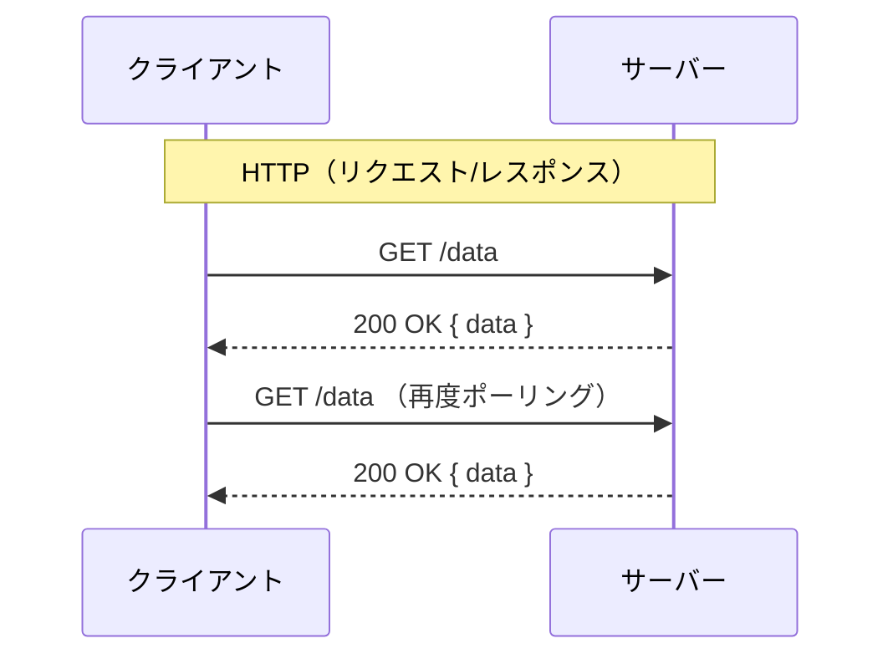
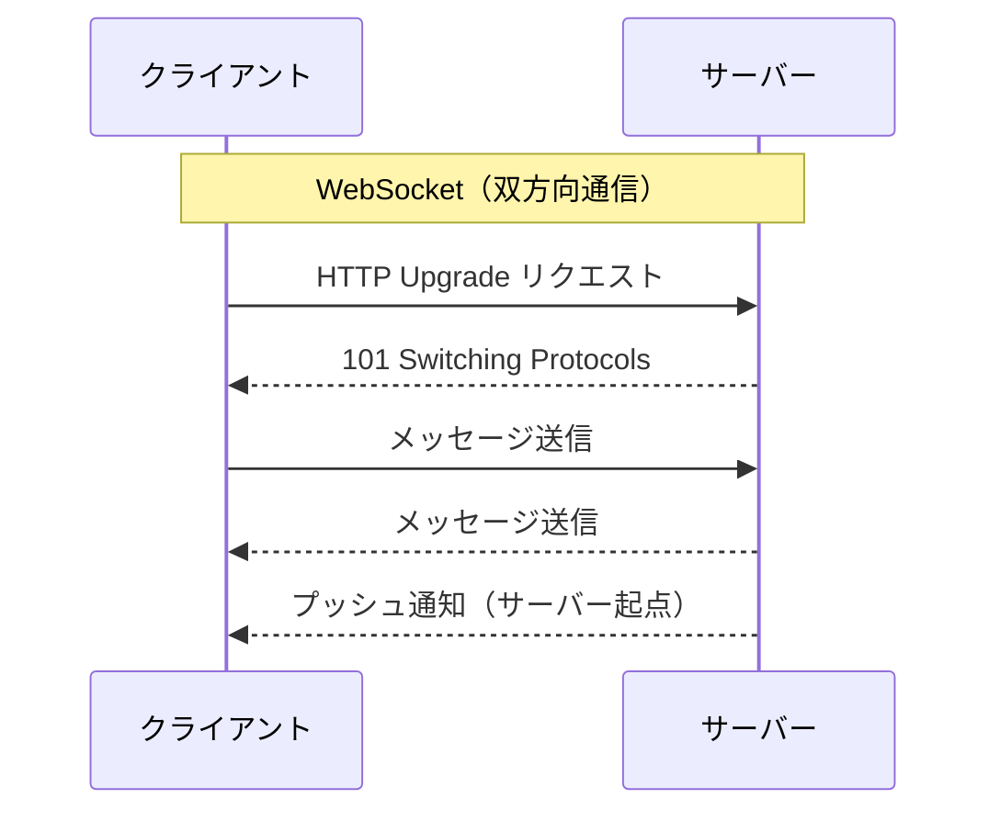

## はじめに

Webアプリを開発していると、「リアルタイム通信を実装したい」という場面に出会います。
そのとき選択肢として上がるのが **HTTP** と **WebSocket** です。

この記事では、両者の仕組みの違いを図解で整理し、どの場面でどちらを選ぶべきかを解説します。

対象読者:

- Webの通信の仕組みを基礎から理解したい方
- チャットや通知などリアルタイム機能の実装を検討している方
- HTTPとWebSocketの使い分けに迷っている方

## HTTPとは

HTTPとは1リクエスト・1レスポンスで完結する通信方式です。
主に画面表示やREST APIで使用されます。

リクエストごとに独立して処理され、サーバー側が前回の通信状態を保持しないことを**ステートレス**といいます。
前に通信した情報を利用したい場合はCookieやJWTを使用します。

クライアントから通信することはあっても、サーバーから通信をプッシュすることはありません。

:::message
HTTP/1.1からはKeep-Alive（持続接続）がデフォルトで有効です。
一度TCP接続を確立すると一定時間は接続を保ち、複数回やり取りできます。
ただし「同じTCP接続で複数リクエストを送れる」最適化であり、リクエスト間での状態は保持されません。
:::

## WebSocketとは

リアルタイムで双方向通信ができる仕組みです。
最初の1回はHTTP通信を行い、WebSocketに切り替える指示をサーバーに送ることで成立します。

リアルタイムでやり取りできることからチャットなどで利用されます。
双方向ということもあり、サーバーからもプッシュすることができます。

## 仕組みの違いを図解する





## パフォーマンスの違い

HTTPはリクエストのたびにヘッダーが付与されます。
ヘッダーには `Cookie` や `User-Agent` などが含まれるため、数百バイト〜数KBになることもあります。

一方WebSocketは、最初の接続確立後のフレームヘッダーが **2〜10バイト** 程度と非常に小さくなります。
接続を維持するため接続確立コストも最初の1回のみです。

高頻度で小さいデータをやり取りする場面（チャットなど）では、この差が顕著に表れます。

| 比較項目 | HTTP | WebSocket |
|---|---|---|
| ヘッダーサイズ | 数百バイト〜数KB（毎回） | 2〜10バイト（接続後） |
| 接続確立コスト | リクエストごとに発生 | 最初の1回のみ |
| サーバー起点の通信 | 不可 | 可能 |

## 使い分けの基準

| ユースケース | 推奨 | 理由 |
|---|---|---|
| 一般的なAPIリクエスト | HTTP | シンプルでキャッシュも効く |
| チャットアプリ | WebSocket | 双方向リアルタイム通信が必要 |
| 株価など高頻度更新 | WebSocket | ポーリングより低遅延・低負荷 |
| 単発の通知 | HTTP (SSE) | サーバー→クライアントの一方向で十分 |

## コード例

### HTTPでのポーリング実装

`fetch` を使って一定間隔でデータを取得するシンプルなポーリングです。

```javascript
async function pollData() {
  const response = await fetch('/api/messages');
  const data = await response.json();
  console.log(data);
}

// 5秒ごとにデータを取得する
setInterval(pollData, 5000);
```

リクエストのたびにHTTPオーバーヘッドが発生するため、高頻度では負荷が大きくなります。

### WebSocketの実装

ブラウザ標準の `WebSocket` APIを使った双方向通信の例です。

```javascript
const ws = new WebSocket('wss://example.com/chat');

// 接続確立時
ws.addEventListener('open', () => {
  console.log('接続しました');
  ws.send(JSON.stringify({ text: 'こんにちは' }));
});

// メッセージ受信時（サーバーからのプッシュも含む）
ws.addEventListener('message', (event) => {
  const data = JSON.parse(event.data);
  console.log('受信:', data);
});

// 接続終了時
ws.addEventListener('close', () => {
  console.log('接続が閉じました');
});
```

一度接続を確立すれば、サーバー・クライアント双方からいつでもメッセージを送ることができます。

## まとめ

- HTTP はリクエスト/レスポンス型の**ステートレスな通信**で、通常のWeb APIに適している
- WebSocket は一度接続を確立した後に**双方向通信**が可能で、リアルタイム機能に適している
- HTTPはヘッダーオーバーヘッドがあり、WebSocketは接続後のフレームが軽量なため高頻度通信に向いている
- 要件に応じて使い分けることで、パフォーマンスとシンプルさのバランスが取れる
