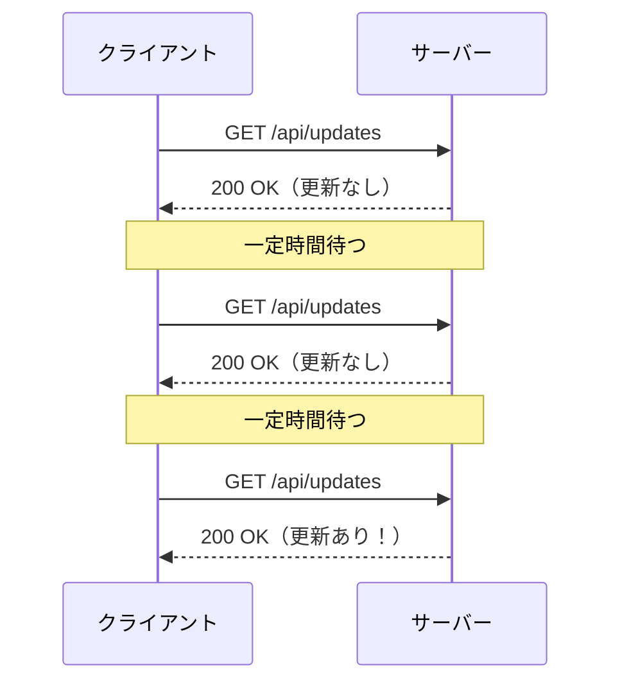
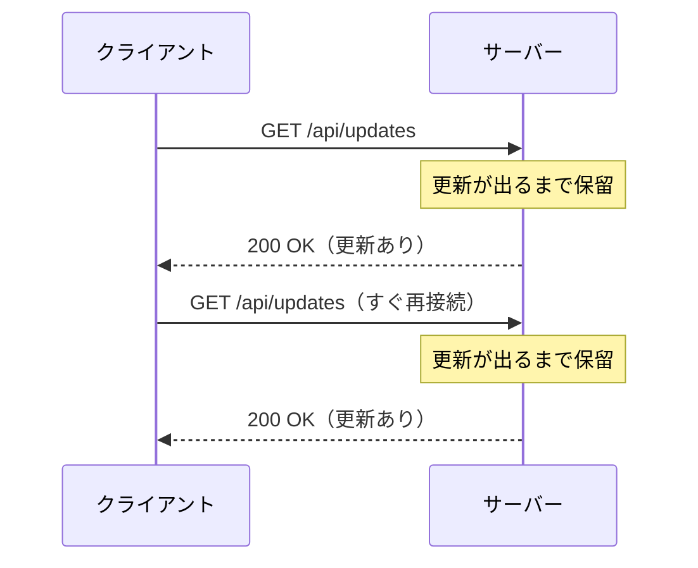
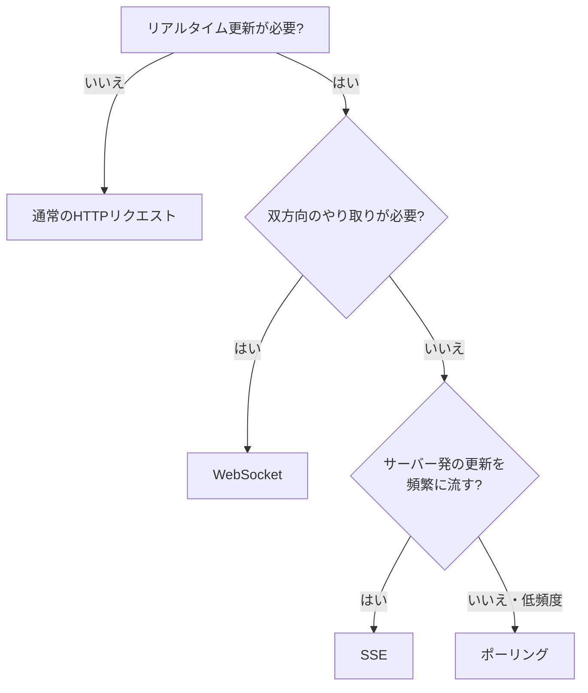

## はじめに

「画面を最新の状態に保ちたい」という場面はよくあります。
通知、在庫状況、処理の進捗、チャットなどです。
こうしたリアルタイム更新では、まず WebSocket や SSE が候補に挙がります。

ただ、その前にもっと素朴な方法があります。
それが**ポーリング**です。
クライアントが定期的にサーバーへ問い合わせる、シンプルな仕組みです。

まずポーリングで足りるかを判断できると、無駄に複雑な実装を避けられます。

:::message
この記事の対象読者
- リアルタイム更新の実装方法を整理したい初〜中級者
- WebSocket や SSE を検討する前に選択肢を比較したい人
:::

この記事で得られることは次の3つです。

- ポーリングの仕組みと通信フロー
- ショートポーリングとロングポーリングの違い
- SSE・WebSocket との使い分けの判断基準

## ポーリングとは

ポーリングは、クライアントが一定間隔でサーバーへ問い合わせる方式です。
「更新はありますか？」と繰り返し聞きに行くイメージです。

サーバー側は特別なことをしません。
普通の HTTP リクエストに、普通の HTTP レスポンスを返すだけです。
そのため、既存の REST API があればすぐに実装できます。

ポイントは、更新の有無にかかわらず問い合わせ続けることです。
更新がなくても、クライアントは決まった間隔でリクエストを投げます。

## ショートポーリングとロングポーリング

ポーリングには2つの方式があります。
**ショートポーリング**と**ロングポーリング**です。
違いは「サーバーがすぐ返すか、待ってから返すか」です。

### ショートポーリング

一定間隔でリクエストを投げ、サーバーは即座にレスポンスを返します。
更新がなくても「ありません」とすぐ返します。

実装はとても簡単です。
ただし更新がない間も通信が発生し、空振りが増えます。

### ロングポーリング

リクエストを受けたサーバーが、更新が出るまでレスポンスを保留します。
更新が発生した瞬間にレスポンスを返します。
クライアントは受け取ったら、すぐ次のリクエストを投げ直します。

空振りが減り、更新の即時性も上がります。
その代わり、接続を長く保つぶんサーバーの実装は少し複雑になります。

| 観点 | ショートポーリング | ロングポーリング |
|---|---|---|
| レスポンス | 即座に返す | 更新が出るまで保留 |
| リアルタイム性 | 低い（間隔に依存） | 高い |
| 空振りリクエスト | 多い | 少ない |
| サーバー実装 | 単純 | やや複雑 |

:::message
ロングポーリングは「擬似的なサーバープッシュ」です。
本来プッシュが欲しい場面の代替として使われてきました。
今は SSE や WebSocket という専用の手段があります。
:::

## ポーリングのメリット・デメリット

ポーリングの強みは、なんといってもシンプルさです。

**メリット**

- 普通の HTTP だけで完結する（特別なプロトコル不要）
- 既存の REST API をそのまま使える
- サーバーが状態を保持しない（ステートレス）ので扱いやすい
- プロキシやロードバランサーとの相性が良い
- デバッグが容易（ただの HTTP リクエスト）

**デメリット**

- 更新から反映までに最大「間隔ぶん」の遅延が出る
- 更新がなくてもリクエストが飛び、無駄が多い
- 高頻度・多人数だとサーバー負荷が跳ね上がる
- 毎回 HTTP ヘッダーのオーバーヘッドがかかる

:::message
ポーリング間隔はトレードオフです。
短くするとリアルタイム性は上がりますが、負荷も増えます。
長くすると負荷は減りますが、反映が遅れます。
:::

## SSE・WebSocket との比較

リアルタイム性をさらに高めたいなら、SSE や WebSocket が候補になります。
それぞれの位置づけを並べて比較します。

| 観点 | ショートポーリング | ロングポーリング | SSE | WebSocket |
|---|---|---|---|---|
| 通信方向 | 取得のみ | 取得のみ | サーバー→クライアント | 双方向 |
| リアルタイム性 | 低い | 中〜高 | 高い | 高い |
| 実装コスト | 最も低い | 低い | 低い | やや高い |
| サーバー負荷 | 高い（空振り） | 中 | 低い | 低い |
| 自動再接続 | 不要（都度接続） | 不要 | ブラウザ標準 | 自前で実装 |
| 主な用途 | 低頻度の更新確認 | 即時性が欲しい通知 | 通知・進捗・配信 | チャット・ゲーム |

大きな流れはこうです。
ポーリングは「取りに行く（pull）」、SSE と WebSocket は「届く（push）」仕組みです。
取りに行く回数が増えるほど、プッシュ型の優位が大きくなります。

:::message
SSE と WebSocket そのものの詳細は別記事で扱っています。
- サーバープッシュを HTTP だけで実現する「SSE（Server-Sent Events）入門」
- 双方向通信の基礎「HTTP と WebSocket の違いを図解で理解する」

あわせて読むと、選択の解像度が上がります。
:::

## どれを選ぶ？判断基準

迷ったら、次の順で考えると整理できます。

判断の軸は次の4つです。

- **双方向性**: クライアントからも送るなら WebSocket
- **更新頻度**: 高頻度で流れ続けるなら SSE
- **許容遅延**: 多少遅れてよいならポーリングで十分
- **実装コスト**: シンプルさ最優先ならポーリング

ユースケース別の目安は次のとおりです。

| ユースケース | 推奨 | 理由 |
|---|---|---|
| 数分おきの在庫・ステータス確認 | ショートポーリング | 低頻度なら空振りコストが小さい |
| ジョブ完了の通知 | ロングポーリング / SSE | 即時性は要るが双方向は不要 |
| 進捗バー・ライブスコア | SSE | サーバー発の一方向ストリーム |
| チャット・協調編集・ゲーム | WebSocket | 双方向・低遅延が必須 |

:::message
「とりあえず WebSocket」は避けたい選択です。
双方向が不要なら、SSE やポーリングのほうが運用は楽になります。
要件に対して過剰な手段を選ばないことが大切です。
:::

## まとめ

- ポーリングはクライアントが定期的に問い合わせるシンプルな方式です
- ショートポーリングは即レス、ロングポーリングは更新まで保留します
- HTTP だけで完結する手軽さが最大の強みです
- 一方で遅延・空振り・負荷というコストがあります
- 双方向なら WebSocket、サーバー発の高頻度配信なら SSE、低頻度の確認ならポーリングが基準です

まずはポーリングで足りないかを考え、足りなければ SSE や WebSocket へ進むと、過不足のない選択ができます。
