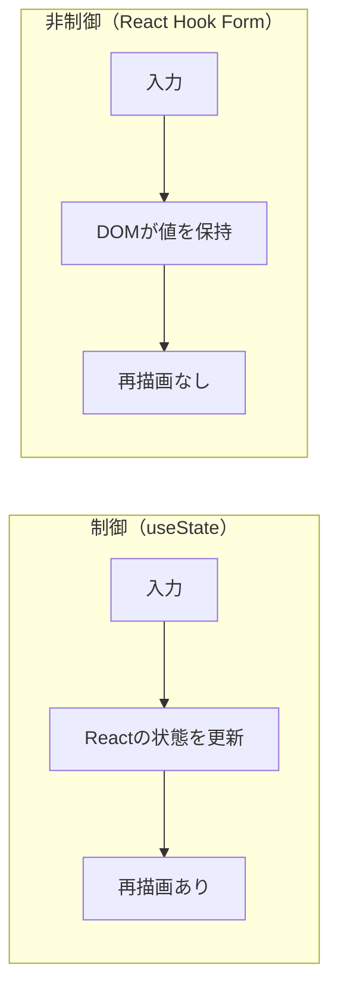
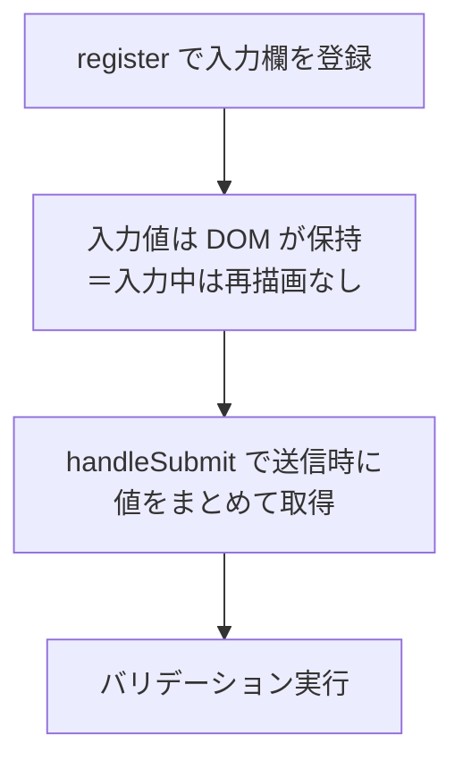

## はじめに

React でフォームを作ると、意外と手間がかかります。
入力欄ごとに `useState` を用意し、`onChange` で更新する必要があります。
入力するたびに状態が変わり、コンポーネントが再描画されます。
欄が増えるほど、状態とハンドラのコードもふくらみます。

この煩わしさを解いてくれるのが **React Hook Form** です。
最小限の記述で、入力管理・バリデーション・送信をまとめて扱えます。

:::message
この記事の対象読者
- React のフォーム実装が冗長だと感じている人
- React Hook Form を使う前に「なぜ軽いのか」を理解したい人
:::

この記事で得られることは次の3つです。

- React Hook Form がどんなライブラリか
- 再描画が少ない理由（非制御コンポーネントの仕組み）
- 素の `useState` と何が違うのか

なお、この記事は仕組みと使いどころの理解を目的とします。
具体的な API の書き方には踏み込みません。

## React Hook Form とは

React Hook Form は、React 向けのフォーム管理ライブラリです。
略して RHF と呼ばれます。

役割は大きく3つです。

- 入力値の管理
- バリデーション（入力チェック）
- 送信時の値のとりまとめ

これらを、少ないコードと少ない再描画で実現します。
軽量で依存も少なく、導入のハードルが低いのも特徴です。

## なぜ React Hook Form なのか

良さを理解するには、素の `useState` での実装を思い出すと早いです。

`useState` でフォームを作ると、入力欄ごとに状態を持たせます。
ユーザーがキーを打つたびに `onChange` が走り、状態を更新します。
状態が変わるので、そのたびにコンポーネントが再描画されます。
欄が10個あれば、入力のたびにフォーム全体が描き直されます。

React Hook Form は、この「入力ごとの再描画」を避けます。
仕組みは次のセクションで見ますが、結果として無駄な再描画が減ります。
さらに、状態やハンドラを自分で書く量も大きく減ります。

| 観点 | 素の `useState` | React Hook Form |
|---|---|---|
| 記述量 | 多い（欄ごとに状態とハンドラ） | 少ない（`register` で登録するだけ） |
| 入力ごとの再描画 | 起きる | ほぼ起きない |
| バリデーション | 自前で実装 | 組み込み＋スキーマ連携 |
| 学習コスト | 低い | 低い |

## 仕組み（非制御コンポーネント）

React Hook Form の再描画が少ない理由は「非制御コンポーネント」にあります。

React のフォームには2つの方式があります。

- **制御コンポーネント**: 入力値を React の状態で管理する
- **非制御コンポーネント**: 入力値を DOM 自身に持たせる

`useState` を使う方法は前者です。
React Hook Form は後者を使います。

具体的には、各入力欄を `register` で登録します。
入力中の値は React の状態ではなく、DOM が保持します。
そのため、キー入力のたびの再描画が起きません。
そして送信時に `handleSubmit` で値をまとめて取り出します。

:::message
「再描画を抑える」のが React Hook Form の核心です。
入力のたびに React を巻き込まないことで、無駄な再描画を防いでいます。
ただし `watch` で値を監視する場合や、`Controller` で UI ライブラリと繋ぐ場合は再描画が発生します。
:::

## まとめ

- React Hook Form は軽量な React フォーム管理ライブラリです
- 非制御コンポーネントを使い、入力ごとの再描画を抑えます
- `register` で登録し、`handleSubmit` で値をまとめて取得します
- 複雑な入力チェックは Zod などのスキーマ連携で対応できます

フォーム実装で迷ったら、まず React Hook Form を選ぶ。
それだけで、コード量と動作の軽さの両方を改善できます。

:::message
「なぜ再描画がコストになるのか」は、別記事
「React の仮想 DOM とレンダリングの仕組み」で詳しく扱っています。
状態管理そのものを見直すなら「Zustand 入門」もあわせてどうぞ。
:::
