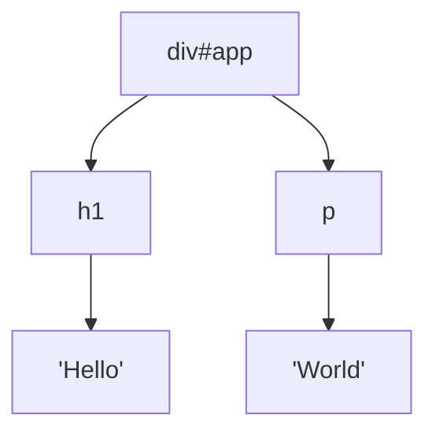
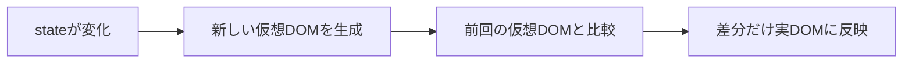

## はじめに

Reactを使っていると、`useState`で状態を変えるだけで画面が更新されます。`document.getElementById`のようなDOM操作を自分で書くことはほとんどありません。

では、Reactは裏側でどうやってDOMを書き換えているのでしょうか？

この記事では以下を解説します。

- そもそもDOMとは何か
- 素朴なDOM操作の何が問題なのか
- 仮想DOM（Virtual DOM）の正体
- 差分検出（Reconciliation）の仕組み
- `key`が重要な理由
- 再レンダリングが起きるタイミング

対象読者は「Reactは使えるが、内部でDOMがどう更新されるかは曖昧」という方です。

## DOMとは何か

**DOM（Document Object Model）**とは、ブラウザがHTMLをツリー構造のオブジェクトとして表現したものです。

例えば次のHTMLは、

```html
<div id="app">
  <h1>Hello</h1>
  <p>World</p>
</div>
```

ブラウザ内部では次のようなツリーになります。



JavaScriptはこのツリーを操作することで、画面の表示を書き換えられます。

```js
document.getElementById("app").querySelector("p").textContent = "React";
```

## 素朴なDOM操作の問題点

DOMを直接操作する方法は、UIが複雑になるほど扱いづらくなります。

### 1. 手続き的でコードが追いにくい

「どこを」「どう変えるか」を一つひとつ手で書く必要があります。状態と表示の対応関係がコードに散らばり、全体像が把握しづらくなります。

### 2. DOM操作はコストが高い

DOMの更新は、ブラウザのレイアウト計算や再描画（リフロー: reflow、リペイント: repaint）を引き起こします。頻繁に直接操作すると、パフォーマンスの低下につながります。

:::message
特に「ループの中で何度もDOMを書き換える」ような処理は、そのたびに再描画が走り、重くなりがちです。
:::

## Reactのアプローチ：宣言的UI

Reactはこの問題を**宣言的UI**で解決します。

「DOMをどう操作するか（手続き）」ではなく、「状態がこのときUIはこうなる（結果）」を書きます。

```jsx
function Counter() {
  const [count, setCount] = useState(0);
  return <button onClick={() => setCount(count + 1)}>{count}</button>;
}
```

開発者は`count`という状態を更新するだけです。実際のDOM更新はReactが担当します。

この「状態からUIへの変換」を効率的に行うための仕組みが、**仮想DOM**です。

## 仮想DOM（Virtual DOM）とは

仮想DOMとは、**実際のDOMを模した軽量なJavaScriptオブジェクト**です。

JSXはビルド時に要素を生成する関数呼び出しへ変換され、最終的に次のようなオブジェクトになります。

```js
// <h1 className="title">Hello</h1> は、おおよそ次のオブジェクトになる
{
  type: "h1",
  props: { className: "title", children: "Hello" }
}
```

:::message
React 16までは、JSXは`React.createElement()`の呼び出しへ変換されていました。React 17以降はデフォルトが`react/jsx-runtime`の`jsx`関数に変わっていますが、**生成される要素オブジェクトの考え方は同じ**です。
:::

これはただのJavaScriptオブジェクトなので、生成や比較が軽量です。Reactはこの仮想DOMツリーをメモリ上に保持します。

:::message
仮想DOMは「実DOMの軽量なコピー」とよく説明されます。ただし、**仮想DOMは「直接DOMを触るより必ず速い」わけではありません**。本質は、宣言的に書きつつ実DOMへの操作回数を最小限に抑えられる点にあります。
:::

## 差分検出（Reconciliation）の仕組み

状態が変わると、Reactは次の流れでDOMを更新します。

1. 新しい仮想DOMツリーを生成する
2. 前回の仮想DOMツリーと**比較（diff）**する
3. 変わった部分**だけ**を実DOMに反映する

この一連の処理を**Reconciliation（再調整）**と呼びます。



ポイントは、**実DOMへ触る回数を最小限に抑える**ことです。画面全体を作り直すのではなく、変化した箇所のみをピンポイントで更新します。

### 差分検出を高速にする工夫

本来、2つのツリーを厳密に比較する計算は重い処理です。Reactは現実的な速度を出すため、いくつかの前提を置いています。

- **要素のtypeが違えば、その先は作り直す**（`div`→`span`なら中身ごと再生成）
- **同じ階層の比較に限定する**（離れた場所への移動は追わない）
- **リストは`key`で対応関係を判断する**

## `key`が重要な理由

リストを描画するとき、Reactは`key`を使って「前回のどの要素と同じか」を判断します。

```jsx
{items.map((item) => (
  <li key={item.id}>{item.name}</li>
))}
```

`key`が安定していれば、要素の追加・削除・並べ替えを正しく検出できます。

### indexをkeyにしてはいけない理由

配列のindexを`key`にすると、並べ替えや要素の挿入で対応関係がずれます。

```jsx
// アンチパターン：並べ替えると挙動がおかしくなることがある
{items.map((item, index) => (
  <li key={index}>{item.name}</li>
))}
```

:::message alert
indexをkeyにすると、入力フォームの値が別の行に紐づくなどのバグが起きやすくなります。リストには一意で安定したIDを使いましょう。
:::

たとえば、各行にテキスト入力を持つTODOリストを考えます。`key={index}`のまま先頭へ新しい項目を追加すると、既存の各行のindexが1つずつ後ろにずれます。Reactは「同じindex＝同じ要素」とみなすため、**入力中だった文字が一つ下の行に残ったように見える**といった不具合が起こります。`key`に`item.id`のような安定した値を使えば要素の対応が正しく保たれ、この問題を防げます。

## 再レンダリングが起きるタイミング

Reactコンポーネントが再レンダリングされる主な条件は次の3つです。

| トリガー | 説明 |
|----------|------|
| stateの変更 | `useState` / `useReducer` の更新関数を呼んだとき |
| propsの変更 | 親から渡される値が変わったとき |
| 親の再レンダリング | 親が再レンダリングされると、子も基本的に再レンダリングされる |

ここで誤解しやすいのが、**「再レンダリング ≠ 実DOMの更新」**という点です。

再レンダリングとは「コンポーネント関数を再実行して新しい仮想DOMを作ること」です。その結果が前回と同じなら、実DOMは更新されません。

:::message
「再レンダリングされる＝画面が描き直される」ではありません。差分がなければ実DOMは変化しないため、再レンダリング自体は必ずしも悪ではありません。
:::

とはいえ、巨大なコンポーネントでの過剰な再レンダリングはコストになります。その場合は`React.memo`・`useMemo`・`useCallback`で、不要な再計算を抑えられます。

## レンダリングフェーズとコミットフェーズ

ここで「仮想DOMを新しく作ること」と「実DOMを書き換えること」は、別のタイミングで行われる点を押さえておきましょう。Reactの更新は次の2つのフェーズに分かれています。

### ① レンダリングフェーズ（Render Phase）

コンポーネント関数を実行して新しい仮想DOMを生成し、前回のツリーと比較して「どこをどう変えるか」を計算します。**この段階では実DOMには一切触りません**。純粋な計算なので、React 18の並行レンダリングでは中断・再開もできます。

### ② コミットフェーズ（Commit Phase）

①で計算した差分を、**まとめて実DOMへ反映します**。ノードの追加・属性の変更・削除などはここで実行されます。このフェーズは同期的に一気に行われ、途中で中断されません。

```text
setState 実行
   ↓
[レンダリングフェーズ]  新しい仮想DOMを生成 ＆ 差分を計算（実DOMはまだ変わらない）
   ↓
[コミットフェーズ]      差分を実DOMへ反映 ★ここで画面が更新される
   ↓
ブラウザが再描画（paint）
```

:::message
「再レンダリングしても実DOMが変わらないことがある」のは、レンダリングフェーズの差分計算で変化がゼロなら、コミットフェーズで反映するものが無いからです。
:::

副作用フックの実行タイミングも、この2フェーズで理解できます。

| 処理 | タイミング |
|------|-----------|
| 仮想DOM生成・差分計算 | レンダリングフェーズ |
| 実DOM更新 | コミットフェーズ |
| `useLayoutEffect` | コミット直後・ブラウザ描画**前**（同期） |
| `useEffect` | ブラウザ描画**後**（非同期） |

`useLayoutEffect`でDOMのサイズや位置を測れるのは、「実DOM更新済み・描画前」というこの隙間で動くからです。

## 発展：FiberとReact 18の並行レンダリング

React 16から、内部アーキテクチャは**Fiber**と呼ばれる仕組みに刷新されました。

Fiberにより、レンダリング作業を小さな単位に分割し、途中で中断・再開できるようになりました。これがReact 18の**並行レンダリング（Concurrent Rendering）**の土台です。

これにより、重い更新の途中でもユーザー入力などの優先度が高い処理を先に反映できます。普段のReact利用で意識する必要はありません。ただ、「仮想DOMの比較を賢くスケジューリングしている」とイメージすると、理解が深まります。

## まとめ

- DOMはブラウザがHTMLをツリー構造で表現したもの
- DOMの直接操作は手続き的になりやすく、再描画コストも高い
- Reactは**宣言的UI**で「状態→UI」を記述する
- 仮想DOMは**実DOMを模した軽量なJavaScriptオブジェクト**
- 状態変化のたびに新旧の仮想DOMを比較し、**差分だけ**を実DOMへ反映する（Reconciliation）
- リストの差分検出には**安定した`key`**が不可欠
- 更新は**レンダリングフェーズ（仮想DOM生成・差分計算）→ コミットフェーズ（実DOM更新）**の2段階で進む
- 再レンダリングは「関数の再実行」であり、必ずしも実DOM更新を意味しない
