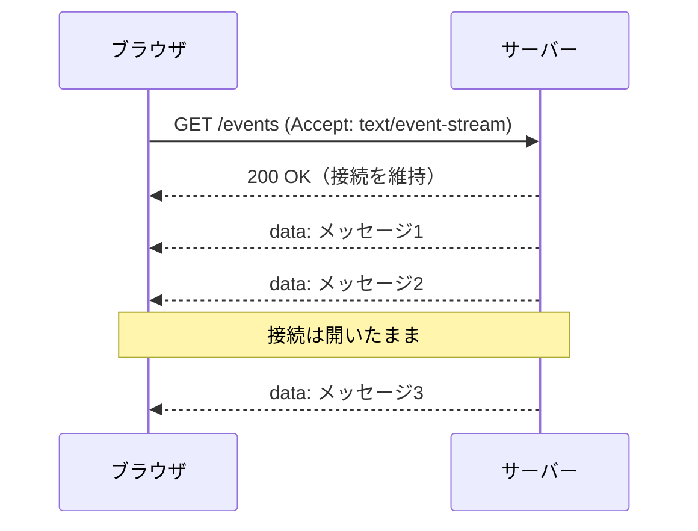

## はじめに

リアルタイムにデータを画面へ反映したい場面はよくあります。
通知、進捗バー、ライブスコア、AI の逐次出力などです。
こうした「サーバーからの更新を受け取りたい」用途で、まず候補に挙がるのが WebSocket です。
ただ、双方向通信が不要ならもっと手軽な選択肢があります。
それが SSE（Server-Sent Events）です。

:::message
この記事の対象読者
- リアルタイム更新を実装したいフロント／バックエンドの初〜中級者
- WebSocket を検討したが「大げさかも」と感じている人
:::

この記事で得られることは次の3つです。

- SSE の仕組みと通信フロー
- 自動再接続や運用時のハマりどころ
- WebSocket との使い分けの基準

## SSE（Server-Sent Events）とは

SSE はサーバーからクライアントへ一方向にデータを送る仕組みです。
HTML Living Standard で定義された標準仕様です。
特別なプロトコルは使いません。
通常の HTTP 接続を開いたままにして使います。
サーバーは接続を保ったまま、イベントを少しずつ書き込みます。
ブラウザ側は EventSource API で受け取ります。



ポイントは、リクエストが最初の1回だけという点です。
あとはサーバーが好きなタイミングで送れます。
ポーリングのように何度もリクエストを投げる必要はありません。

## なぜ SSE なのか（ユースケース）

SSE が向いているのは、サーバー発の更新を流し続ける用途です。

- アプリ内通知・お知らせの配信
- 時間のかかる処理の進捗バー
- 株価やスポーツのライブスコア
- タイムラインやフィードの新着
- AI（LLM）のトークン逐次出力

:::message
ChatGPT や Claude の API のストリーミング応答も、実体は SSE 形式です。
`text/event-stream` で `data:` が少しずつ流れてきます。
:::

これらは「クライアントから送り返す必要がない」点が共通しています。
受け取るだけで済むなら、SSE がちょうど良い選択肢です。

## WebSocket との違い

最大の違いは通信方向です。
SSE は一方向、WebSocket は双方向です。

| 観点 | SSE | WebSocket |
|---|---|---|
| 通信方向 | サーバー→クライアントの一方向 | 双方向 |
| プロトコル | HTTP をそのまま使う | ws / wss（HTTP からアップグレード） |
| データ形式 | UTF-8 テキストのみ | テキスト／バイナリ |
| 自動再接続 | ブラウザ標準で対応 | 自前で実装 |
| 実装コスト | 低い | やや高い |
| 主な用途 | 通知・進捗・フィード配信 | チャット・ゲーム・協調編集 |

判断軸はシンプルです。

- 双方向のやり取りが必要 → WebSocket
- サーバーからの一方向で十分 → SSE

:::message
HTTP と WebSocket そのものの違いは別記事「HTTP と WebSocket の基礎」で扱っています。
あわせて読むと、選択の解像度が上がります。
:::

## イベントの書式

SSE がやり取りするのは、決まった書式のテキストです。
1つのイベントは複数の行で構成し、空行で区切ります。

```text
event: message
data: こんにちは
id: 1

data: 複数行は
data: data 行を並べる
id: 2
```

主なフィールドは次のとおりです。

| フィールド | 役割 |
|---|---|
| `data` | 本文。`data:` を複数行並べると改行で連結される |
| `event` | イベントの種類名。省略時は `message` |
| `id` | イベントID。再接続時に `Last-Event-ID` として使われる |
| `retry` | 再接続までの待ち時間（ミリ秒） |

この書式さえ送れば、特別なライブラリは要りません。

## 自動再接続と Last-Event-ID

SSE の便利な点は、再接続が標準装備なことです。
接続が切れると、ブラウザが自動でつなぎ直します。
待ち時間は `retry:` で指定できます（既定は約3秒）。

さらに `id:` を付けておくと取りこぼしを防げます。
ブラウザは最後に受け取った `id` を覚えています。
再接続時に `Last-Event-ID` ヘッダーとして送ってきます。
サーバーはその値を見て、続きから再送できます。

## ハマりどころ

SSE 特有の注意点をまとめます。

1. **HTTP/1.1 の同時接続数制限**
ブラウザは1ドメインあたり約6接続までです。
SSE は1本を占有し続けます。
タブを複数開くと枠が枯渇する恐れがあります。
HTTP/2 なら多重化で大きく緩和されます。

2. **プロキシのバッファリング**
`nginx` などが応答をためると、データが届きません。
`X-Accel-Buffering: no` を返すか、バッファリングを切ります。

3. **カスタムヘッダーを送れない**
EventSource は GET 固定で、ヘッダーを追加できません。
認証は Cookie かクエリ文字列で渡すのが基本です。
どうしてもヘッダーが必要なら、`fetch` と `ReadableStream` で自前実装します。

4. **テキストのみ**
SSE は UTF-8 テキスト専用です。
バイナリは Base64 などにエンコードして送ります。

## まとめ

- SSE はサーバー→クライアントの一方向プッシュです
- HTTP の上で動き、特別なプロトコルは不要です
- ブラウザは EventSource API で手軽に購読できます
- 自動再接続と `Last-Event-ID` で取りこぼしに強いです
- 双方向が必要なら WebSocket、受け取るだけなら SSE
