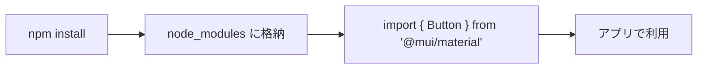
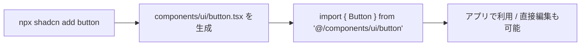
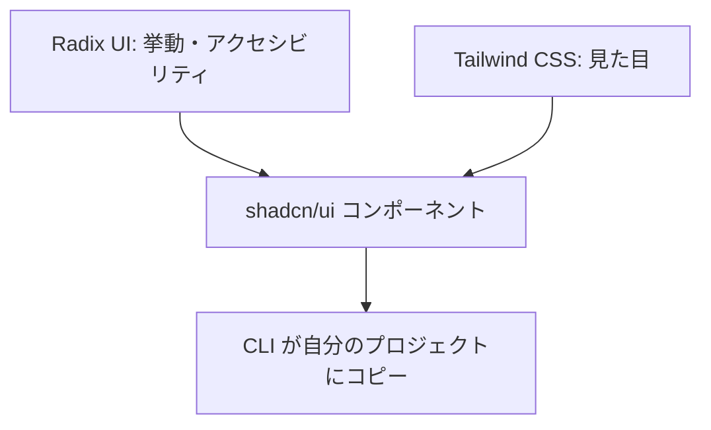

## はじめに

ReactでUIを作るとき、ボタンやモーダル、ドロップダウンを一から実装する際に最近 **shadcn/ui** という名前をよく聞きます。

この記事では以下を解説します。

- shadcn/uiとは何か（何が新しいのか）
- 従来のUIライブラリと何が違うのか
- 内部を支える Tailwind CSS / Radix UI / CLI の役割
- 実際のセットアップの流れ
- メリット・デメリットと、向いているプロジェクト

対象読者は「Reactは使えるが、shadcn/uiが他のUIライブラリと何が違うのかは曖昧」という方です。

## shadcn/uiとは何か

一言でいうと、shadcn/uiは **「コピペして使えるReactコンポーネントのソースコード集」** です。

従来のライブラリのように `npm install` してパッケージとして読み込むことはしません。代わりに、CLI（コマンド）を使って**コンポーネントのソースコードを自分のプロジェクトにコピー**します。コピーされたコードはあなたのものになるので、中身を自由に書き換えられます。

:::message
shadcn/ui は単一のnpmパッケージというより、Tailwind CSS と Radix UI を組み合わせた「コンポーネントの作り方と、その雛形集」を指します。だから公式は「ライブラリではない」と言っています。
:::

## 従来のUIライブラリとの違い

MUIやChakra UIなど従来のライブラリは、次のモデルで動きます。

- `npm install @mui/material` でインストールする
- `import { Button } from "@mui/material"` で使う
- 実装は `node_modules` の中にあり、中身は基本的にいじらない
- カスタマイズはライブラリが用意したAPI（theme、`sx` prop など）の範囲で行う

一方、shadcn/uiはこうです。

- `npx shadcn@latest add button` で、ボタンの**ソースコード**が `components/ui/button.tsx` にコピーされる
- import元は `node_modules` ではなく**自分のプロジェクト内**
- コードは自分の所有物なので、直接編集できる

両者を並べると違いが際立ちます。

| 観点 | 従来のUIライブラリ（MUI等） | shadcn/ui |
|------|------------------------------|-----------|
| 配布形態 | npmパッケージ | ソースコードのコピー |
| 置き場所 | `node_modules` | 自分のリポジトリ |
| カスタマイズ | ライブラリのAPI経由 | コードを直接編集 |
| バージョン管理 | `package.json`で一括 | 各ファイルを手動で管理 |
| バンドルサイズ | 使わない部分も含みがち | 使うものだけ |

:::message
この「**コードそのものを配布する**」という発想が shadcn/ui の核心です。ライブラリを**使う**のではなく、ライブラリの**コードを自分のものにする**と考えると理解しやすくなります。
:::

## 仕組み：Tailwind CSS + Radix UI + CLI

shadcn/uiのコンポーネントは、主に3つの技術で成り立っています。

### Radix UI：挙動とアクセシビリティ

**Radix UI** は「見た目を持たない（unstyled）」コンポーネントのプリミティブ集です。ドロップダウンの開閉、フォーカス管理、キーボード操作、ARIA属性といった**振る舞いとアクセシビリティ**を担当します。

自前で実装すると地味に大変な「Escキーで閉じる」「Tabでフォーカスが循環する」といった部分を、肩代わりしてくれます。

### Tailwind CSS：見た目

Radix が持たない見た目は **Tailwind CSS** のユーティリティクラスで付けます。`className="rounded-md bg-primary px-4 py-2"` のように、スタイルがそのままコンポーネントのコードに書かれています。

### CLI：コピーの仕組み

`shadcn` CLI が、選んだコンポーネントのソースコードをプロジェクトへコピーします。このとき、`components.json` の設定（置き場所やエイリアス）に従ってファイルが配置されます。

加えて、バリアント（見た目の種類）の管理に **class-variance-authority（cva）**、クラス名の結合に `cn` というユーティリティ（**clsx + tailwind-merge** の組み合わせ）が使われます。`cn` は「条件付きでクラスを足しつつ、Tailwindのクラス衝突をうまく解決する」役割で、例えば `px-2` と `px-4` が同時に指定されても、後勝ちで `px-4` だけを残してくれます。

## 実際に使ってみる

:::message
ここでは **Tailwind CSS と TypeScript が設定済みのプロジェクト**（Next.js など）を前提とします。Tailwind が未導入でも `init` がある程度セットアップしてくれますが、対象フレームワークによって手順は変わります。CLIのパッケージ名や設定ファイルの中身はバージョンで変わるため、最新の手順は必ず公式ドキュメントを確認してください。
:::

shadcn/uiの使い方は「初期化 → コンポーネント追加 → import」の3ステップです。

| 手順 | 実行すること | 結果 |
|------|-------------|------|
| ① 初期化 | `npx shadcn@latest init` | 設定ファイル `components.json` が生成される |
| ② 追加 | `npx shadcn@latest add button` | `components/ui/button.tsx` が自分のプロジェクトにコピーされる |
| ③ 利用 | `@/components/ui/button` から import | 自分のコードとして自由に編集できる |

### ① 初期化

`npx shadcn@latest init` を実行すると、スタイルやベースカラーなどを聞かれ、`components.json` という設定ファイルが生成されます。ここには、コンポーネントの置き場所（`@/components`）やユーティリティの場所（`@/lib/utils`）、Tailwindの設定やベースカラーが記録されます。CLIはこの設定を見て、以降のファイルをどこに置くかを決めます。

:::message
以前はCLIのパッケージ名が `shadcn-ui` でしたが、現在は `shadcn` に変わっています。古い記事に `npx shadcn-ui@latest` と書かれていることがありますが、現行は `npx shadcn@latest` です。
:::

### ② コンポーネントを追加する

例えば `npx shadcn@latest add button` を実行すると、ボタンの実装が `components/ui/button.tsx` として生成されます。中身は、`cva` で「variant（見た目）」「size（大きさ）」ごとのTailwindクラスを定義し、`cn` で結合しただけの、ごく普通のReactコンポーネントです。`VariantProps` で型付けされているので、`variant="outline"` のように**型安全**に呼び出せます。気に入らなければ、このファイルを直接開いて書き換えられます。

### ③ 使う

あとは `@/components/ui/button` から `Button` を import し、`variant` や `size` を渡して使うだけです。ポイントは、import元が `@mui/material` のような外部パッケージではなく、**自分のプロジェクト内のファイル**である点です。だからこそ、デザインや挙動を好きなように直せます。

## メリットとデメリット

### メリット

- **カスタマイズが自由**: コードが手元にあるので、デザインも挙動も制限なく変更できる
- **ロックインされにくい**: 特定ライブラリ独自のAPIに縛られない。中身はただのReact + Tailwind
- **バンドルが小さい**: 使うコンポーネントだけをコピーするので、不要なコードが入らない
- **中身を学べる**: 良質な実装がそのまま手元に来るので、コンポーネント設計の勉強になる

### デメリット

- **アップデートが手動**: `npm update` で一括更新…とはいかない。本家が改善されても自分のファイルには自動反映されない
- **保守は自分の責任**: コピーした時点で自分のコードになるので、バグ対応も自分で行う
- **ファイルが増える**: 使うコンポーネントの数だけファイルが増えていく
- **初期理解コスト**: `cva` や `cn`、Radixの構造に最初は戸惑うことがある

:::message
「自動アップデートが効かない」のは欠点であると同時に、「勝手に壊れない」という利点でもあります。良し悪しではなく**トレードオフ**として捉えるのがよいです。
:::

## どんなプロジェクトに向いているか

**向いているケース**

- デザインを細かく作り込みたい
- 独自のデザインシステムを育てていきたい
- ライブラリへの依存・ロックインを避けたい
- すでに Tailwind CSS を使っている

**向いていないケース**

- とにかく速く、考えずに使えるUIが欲しい（完成度の高いMUI等が楽なこともある）
- Tailwind を使っていない／使いたくない
- コンポーネントの保守を抱えたくない、小規模・短命なプロジェクト

:::message
「Tailwind を使っているか」がひとつの分かれ目です。shadcn/uiのスタイルはTailwind前提なので、Tailwindを採用していないプロジェクトとは相性が良くありません。
:::

## まとめ

- shadcn/uiは「`npm install` するライブラリ」ではなく、**コピペして使うコンポーネントのソースコード集**
- CLIでコンポーネントのコードが**自分のプロジェクトにコピー**され、import元は `node_modules` ではなく自分のリポジトリになる
- 中身は **Radix UI（挙動・アクセシビリティ）＋ Tailwind CSS（見た目）** の組み合わせ
- コードが手元にあるので**カスタマイズは自由**だが、**アップデートと保守は自分の責任**になる
- Tailwindを使っていて、デザインを作り込みたい・ロックインを避けたいプロジェクトに向く

「ライブラリではなく、コードの配布」という核心が腑に落ちれば、shadcn/uiの設計思想を理解できたと言えます。
