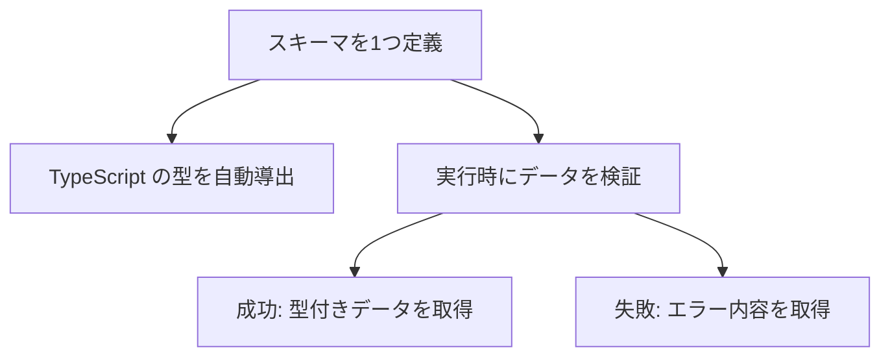

## はじめに

TypeScript を使っていても、実行時のデータは型では守れません。
フォーム入力や API のレスポンスは、期待した形とは限らないからです。
型はコンパイル時のチェックで、実行時には消えてしまいます。

そこで必要になるのが、実行時のバリデーションです。
その定番ライブラリが **Zod** です。
スキーマを1つ書くだけで、検証と型の両方が手に入ります。

:::message
この記事の対象読者
- TypeScript の型と実行時チェックの二重管理に悩んでいる人
- Zod を使う前に「何がうれしいのか」を整理したい人
:::

この記事で得られることは次の3つです。

- Zod がどんなライブラリか
- 型とバリデーションの「二重管理問題」をどう解くか
- どんな場面で Zod を使うとよいか

なお、この記事は仕組みと使いどころの理解を目的とします。
具体的な API の書き方には踏み込みません。
バージョンは Zod v3 系を前提とします。

## Zod とは

Zod は TypeScript 向けのスキーマ宣言・バリデーションライブラリです。
「スキーマ」とは、データの形を定義したものです。

たとえば「名前は文字列」「年齢は0以上の数値」といったルールです。
このルールを Zod のスキーマとして1つ書きます。
あとは、そのスキーマで実際のデータを検証できます。

特徴は、スキーマから TypeScript の型を自動で導き出せる点です。
検証のルールと型が、常に一致した状態を保てます。

## なぜ Zod なのか

Zod の価値は、バリデーションを手書きする場合と比べると分かります。

TypeScript で型を定義しても、実行時のチェックは別に必要です。
そのため、多くの場合こうなります。

- データの「型」を `type` や `interface` で定義する
- 同じ内容の「検証コード」を if 文などで手書きする

つまり、型と検証を**二重に管理**することになります。
片方だけ直して、もう片方を直し忘れる。
この食い違いが、バグの温床になります。

Zod はスキーマを「一つの真実の源」にします。
スキーマから型を導出するので、型と検証が必ず一致します。
二重管理がなくなり、修正もスキーマ1か所で済みます。

| 観点 | 手書きバリデーション | Zod |
|---|---|---|
| 型と検証の管理 | 二重管理（ズレやすい） | スキーマに一元化 |
| 記述量 | 多い（if 文の山） | 少ない（スキーマ1つ） |
| 型との同期 | 手動で合わせる | 自動で導出 |
| エラー内容 | 自前で組み立てる | 構造化されて返る |

## Zod の仕組み（スキーマから型を導出）

Zod の流れは、1つのスキーマを中心に考えると分かりやすいです。

ポイントは、型と検証が同じスキーマから生まれることです。
スキーマを直せば、型も検証も同時に変わります。
だから両者がずれません。

検証に成功すると、型のついた安全なデータが得られます。
失敗すると、どこがどう違うかが構造化されて返ります。

:::message
「スキーマが一つの真実の源になる」のが Zod の核心です。
型のための定義と、検証のための定義を、別々に書かなくて済みます。
:::

## Zod の特徴

Zod が支持される理由を整理します。

- **型推論**: スキーマから TypeScript の型を自動で導出できる
- **2つの検証方法**: 例外を投げる `parse` と、成否を結果で返す `safeParse` を選べる
- **分かりやすいエラー**: どの項目がなぜ失敗したかが構造化されて返る
- **合成・拡張**: 小さなスキーマを組み合わせて大きなスキーマを作れる
- **依存が少ない**: 軽量で、導入のハードルが低い

特に型推論は強力です。
スキーマを書くだけで、対応する型が手に入ります。
型を別途書く必要がないため、記述量と保守の手間が減ります。

## どんなときに使う？

Zod が活きるのは「外から来るデータ」を扱う場面です。
信用できない入力を、境界で検証するのに向いています。

| ユースケース | 役割 |
|---|---|
| フォーム入力 | 送信値の検証（React Hook Form と連携できる） |
| API の入出力 | リクエスト・レスポンスの形を保証する |
| 環境変数 | 起動時に設定値の不足や誤りを検出する |
| 外部データの取り込み | JSON など未知の形を安全な型に変換する |

:::message
React Hook Form と組み合わせると、フォーム検証がさらに楽になります。
スキーマを1つ渡すだけで、入力チェックと型が両立します。
:::

## まとめ

- Zod は TypeScript 向けのスキーマ宣言・バリデーションライブラリです
- スキーマを1つ書くと、型の導出と実行時検証の両方が手に入ります
- 型と検証の「二重管理」を解消し、食い違いによるバグを防げます
- フォーム・API・環境変数など「外から来るデータ」の検証に向いています
- React Hook Form と連携すると、フォーム検証がより簡潔になります

