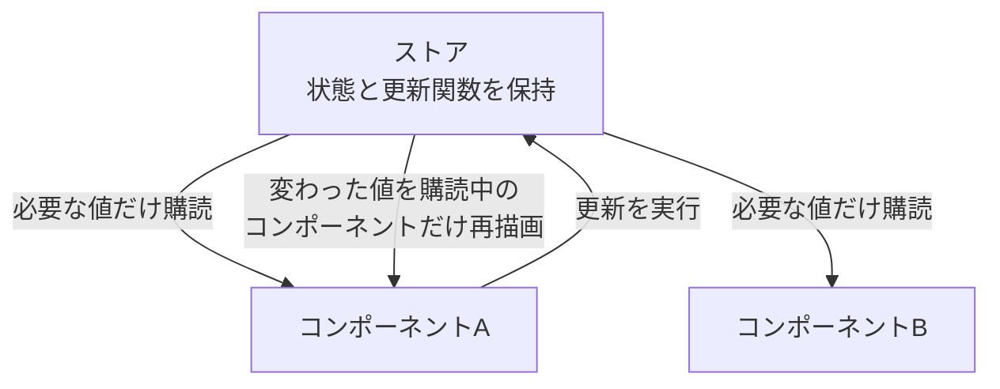
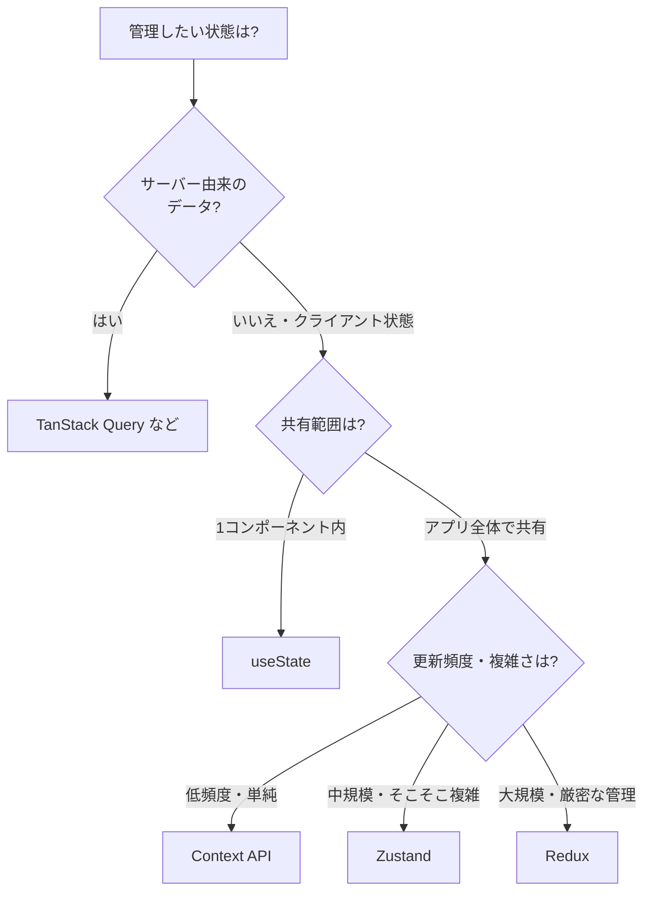

## はじめに

React で状態を複数のコンポーネントから扱いたい場面はよくあります。
ログイン情報、テーマ設定、カート、モーダルの開閉などです。
こうした「アプリ全体で共有する状態」をどう管理するかは悩みどころです。

選択肢としてまず挙がるのが Redux や Context API です。
ただ、Redux は記述量が多く、Context は使い方次第で動作が重くなります。
そこで近年人気なのが、軽量な状態管理ライブラリ **Zustand** です。

:::message
この記事の対象読者
- Redux や Context API の重さ・煩雑さに悩んでいる人
- 状態管理ライブラリの選び方を整理したい React 初〜中級者
:::

この記事で得られることは次の3つです。

- Zustand がどんな仕組みのライブラリか
- Redux・Context API と何が違うのか
- どんなときに Zustand を選べばよいか

なお、この記事は概念と使い分けの理解を目的とします。
具体的な API の書き方には踏み込みません。

## Zustand とは

Zustand はドイツ語で「状態」を意味するライブラリです。
React 向けの、とても軽量な状態管理ライブラリです。

中心になる考え方はシンプルです。
アプリの状態を入れる「ストア」を1つ作ります。
各コンポーネントは、そのストアから必要な値を購読します。
値が変わると、購読しているコンポーネントだけが再描画されます。

特別な準備はほとんど要りません。
後述するように、Redux のような定型コードや、Context のようなプロバイダも不要です。
「ストアを作って、使う」だけで完結します。

## Zustand の仕組み（データの流れ）

Zustand のデータの流れは3ステップで捉えられます。

1. アプリの状態をまとめた**ストア**を作る
2. 各コンポーネントが、ストアから**必要な値だけ購読**する
3. 状態を**更新**すると、購読中のコンポーネントだけが再描画される

ポイントは「必要な値だけ購読」という部分です。
コンポーネント A がカウントだけを購読しているとします。
別の値が変わっても、A は再描画されません。
この仕組みが、Context API との大きな違いを生みます。

:::message
プロバイダでアプリを囲む必要がない点も特徴です。
ストアはコンポーネントの外側で完結します。
そのため、どこからでも同じストアを参照できます。
:::

## Zustand の特徴

Zustand が支持される理由を整理します。

- **プロバイダ不要**: アプリを `Provider` で囲む必要がない
- **定型コードが少ない**: ストアを1つ定義するだけで使える
- **部分的な購読**: 必要な値だけ選んで購読でき、無駄な再描画を防げる
- **小さい**: ライブラリ自体が軽量で、バンドルサイズへの影響が小さい
- **React 非依存の設計**: ストアの仕組みは React の外でも動く考え方になっている

さらに、ミドルウェアで機能を足せます。
代表的なのは `persist` です。
状態を `localStorage` などへ自動保存し、リロードしても復元できます。
ほかにも、開発ツール連携やログ出力のミドルウェアがあります。

:::message
「サーバーから取得したデータ」の管理は、また別の話です。
そこは TanStack Query のような専用ライブラリが向いています。
Zustand はあくまで「クライアント側の状態」を扱う道具です。
:::

## どんなときに使う？

状態管理は、扱う状態の性質で道具を選ぶと整理できます。
次の順で考えると、迷いが減ります。

ユースケース別の目安は次のとおりです。

| ユースケース | 推奨 | 理由 |
|---|---|---|
| 1つのフォームの入力値 | `useState` | 共有不要ならローカル状態で十分 |
| テーマ・言語などほぼ変わらない設定 | Context API | 低頻度更新なら再描画の影響が小さい |
| 認証情報・カート・モーダル管理 | Zustand | 共有が必要で、部分購読の恩恵が大きい |
| 大規模・厳密な状態遷移が必要 | Redux | 規律ある管理と豊富なツールが活きる |
| API から取得した一覧やキャッシュ | TanStack Query | 取得・キャッシュ・再取得を専用に扱える |

:::message
「とりあえず Redux」を選ぶ必要はありません。
共有状態が中規模までなら、Zustand のほうが書く量も学ぶ量も少なくて済みます。
要件に対して過剰な道具を選ばないことが大切です。
:::

## まとめ

- Zustand は軽量な React 状態管理ライブラリです
- ストアを作り、必要な値だけ購読するシンプルな仕組みです
- Redux の定型コードの多さ、Context の再描画問題を避けられます
- プロバイダ不要・部分購読・ミドルウェア（`persist` など）が強みです
- サーバー由来のデータは TanStack Query、共有状態は Zustand と役割で使い分けます

まず `useState` で足りるかを考え、共有が必要になったら Zustand を検討する。
この順で選ぶと、状態管理の道具を過不足なく使えます。

:::message
状態が変わると React がどう再描画するかは、別記事
「React の仮想 DOM とレンダリングの仕組み」で扱っています。
Context の再描画問題と合わせて読むと、状態管理の理解が深まります。
:::
